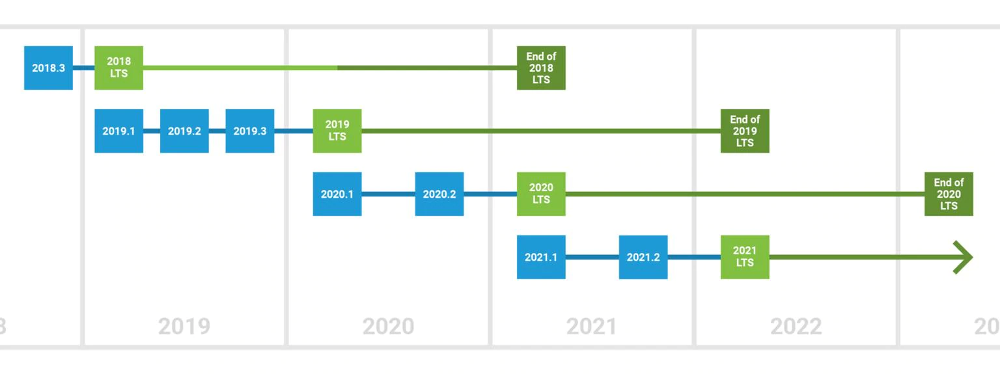

# Mirror Networking


**Stop worrying about networking because we do.**\
We needed a networking library that allows us to [**launch our games**](https://github.com/MirrorNetworking/Mirror#made-with-mirror) and **survive the next decade**.


[**Mirror**](https://assetstore.unity.com/packages/tools/network/mirror-129321) is a **high level** Networking library for Unity, optimized for **ease of use** & **probability of success**.

* Compatible with over a dozen low level [**Transports**](manual/transports/).
* Growing library of [**Script Templates**](manual/general/script-templates.md) to make learning and coding easier.
* Remote Procedure calls and context control via [**Attributes**](manual/guides/attributes.md).
* More than a dozen built in [**Components**](manual/components/).
* Five flavors of [**Interest Management**](manual/interest-management/), and you can make your own custom version.
* Support for [**Additive Scenes**](manual/examples/) with Physics Isolation (battle instances, levels, etc.)
* Several complete [**Examples**](manual/examples/) included.
* Constant improvements and enhancements [**every month**](manual/general/changelog/)**.**
* Full time support available in our [**Discord**](https://discord.gg/2BvnM4R).

## Unity Versions

We will follow Unity's support for **LTS releases**.  Any version beyond those may work, but you're on your own, especially with regard to preview / beta versions.

At the moment, we recommend using Unity 2020 or 2021 LTS releases.

