# Mirror Quick Start Project

This guide currently shows you:

* [Basic scene setup](quick-start-guide.md#part-1)
* [Player movement](quick-start-guide.md#part-4)
* [Names and colours](quick-start-guide.md#part-8)
* [Scene script with canvas buttons](quick-start-guide.md#part-11)
* [Weapon switching](quick-start-guide.md#part-12)
* [Networked scene objects tweak](quick-start-guide.md#part-15)
* [Menu and scene switching](quick-start-guide.md#part-16)
* [Weapon firing](quick-start-guide.md#part-20)

It is best to first make a mini practice game before converting your single player game, or creating your ideal brand new multiplayer.

The Pre-made Mirror examples are great for using as reference, it is recommend to use them regarding connection setup, with ports and firewalls. This can be a huge topic that changes from person to person, and is not covered in this guide, here we will use localHost (multiple games on same PC).\
\
**End Result:**

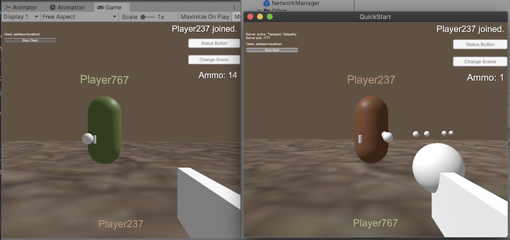

### Part 1 <a href="#part-1" id="part-1"></a>

Blank Project, import Mirror from [Asset Store](https://assetstore.unity.com/packages/tools/network/mirror-129321).

### Part 2 <a href="#part-2" id="part-2"></a>

* Create new scene, save it, and add it to build settings
* Create a new GameObject, name it NetworkManager in the scene, and add these 3 components
  * NetworkManager
  * KCPTransport (TelepathyTransport is older, you do not need KCP and Telepathy)
  * NetworkManagerHUD
* On the NetworkManager component, drag your Offline and Online scene into the slots, we have only one scene for now, so put your scene in both
  * The scene must be in the build settings before dragging it to the field

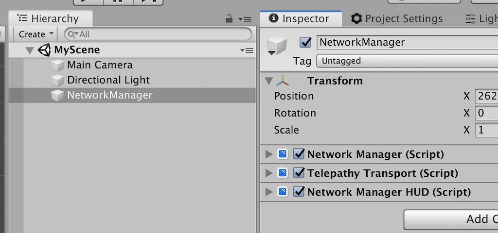

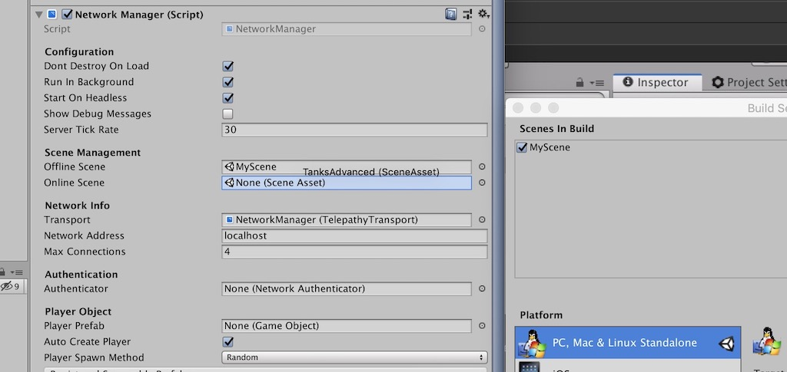

### Part 3 <a href="#part-3" id="part-3"></a>

Setup the scene

* Add a simple Plane floor with:
  * positions (0, -1, 0)
  * scale (2, 2, 2)
* (optional) add a material to this, I added one called dirt that is used one of mirrors examples
* Next we add a GameObject, name does not matter
* Add `NetworkStartPosition` component to this GameObject
* Duplicate the GameObject a few times, and scatter around your scene floor so that you have multiple spawn points. I did 4, one near each corner

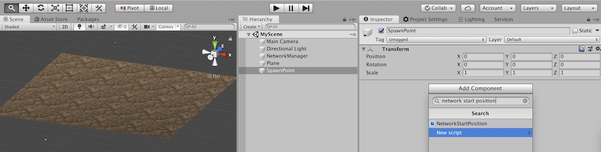

### Part 4 <a href="#part-4" id="part-4"></a>

Creating the player

* Create a capsule using the menus as shown in the image
* Attached a NetworkTransform component, this will auto add a Network Identity
* Tick Client Authority on the NetworkTransform

(Note: Newer Mirror versions use "Sync Direction" set this to "Client To Server".)

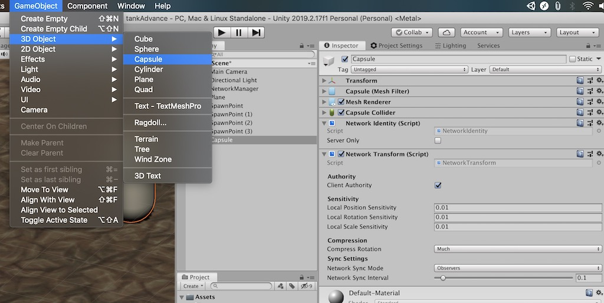

* Rename that object Player
* Add an empty PlayerScript
* Drag into Project to create a prefab
* Then delete Player from scene

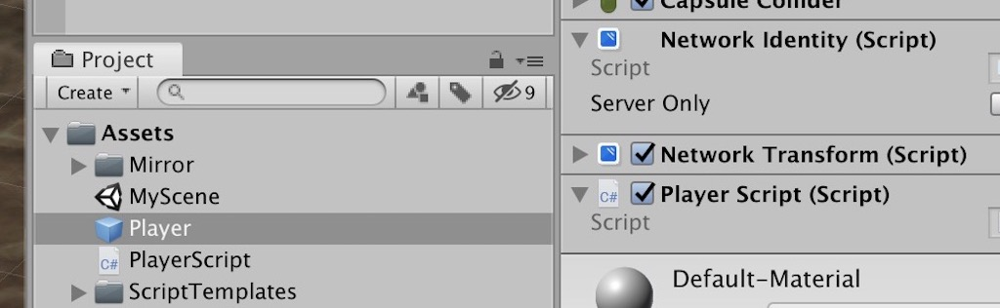

* Drag your player prefab into Network manager,
* Set spawn method to Round Robin.


### Part 5 <a href="#part-5" id="part-5"></a>

Add the following to your PlayerScript.

```csharp
using Mirror;
using UnityEngine;

namespace QuickStart
{
    public class PlayerScript : NetworkBehaviour
    {
        public override void OnStartLocalPlayer()
        {
            Camera.main.transform.SetParent(transform);
            Camera.main.transform.localPosition = new Vector3(0, 0, 0);
        }

        void Update()
        {
            if (!isLocalPlayer) { return; }

            float moveX = Input.GetAxis("Horizontal") * Time.deltaTime * 110.0f;
            float moveZ = Input.GetAxis("Vertical") * Time.deltaTime * 4f;

            transform.Rotate(0, moveX, 0);
            transform.Translate(0, 0, moveZ);
        }
    }
}
```

### Part 6 <a href="#part-6" id="part-6"></a>

Press play in Unity editor, and then Host (server + client) button in the game window. You should be able to move around with a first person view capsule.

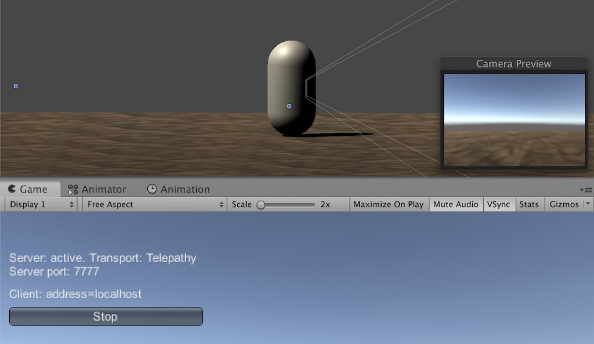

### Part 7 <a href="#part-7" id="part-7"></a>

Build and run your scene, open it, host on one, and press the Client button on the other. Congrats you made a mini multiplayer game!

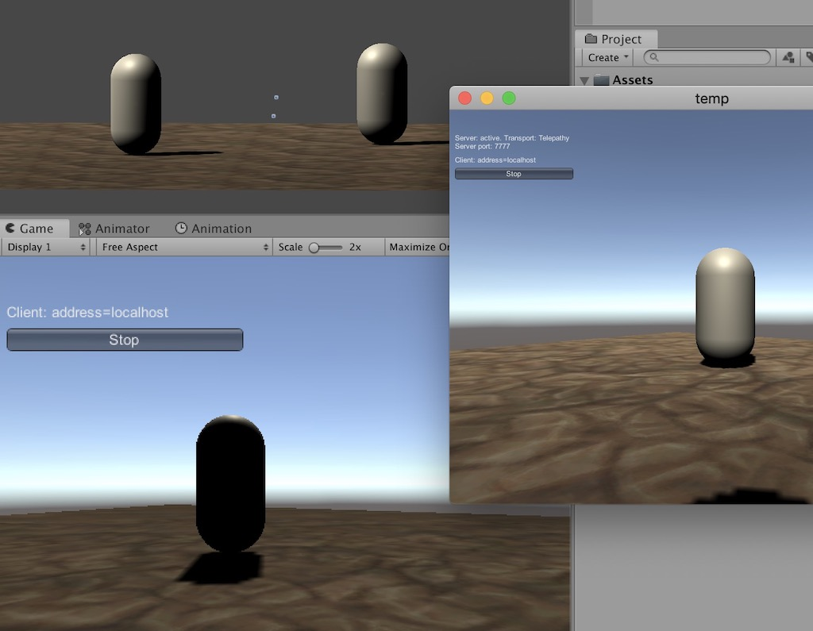

### Part 8 <a href="#part-8" id="part-8"></a>

Player name above heads

* Inside your player Prefab, create an empty GameObject
* name it something like `FloatingInfo`
  * position Y to 1.5
  * scale X to -1
* Inside that `FloatingInfo`, create a 3D text using Unity menu (GameObject - 3D Object - 3D Text),
* Set it up as shown in the picture below

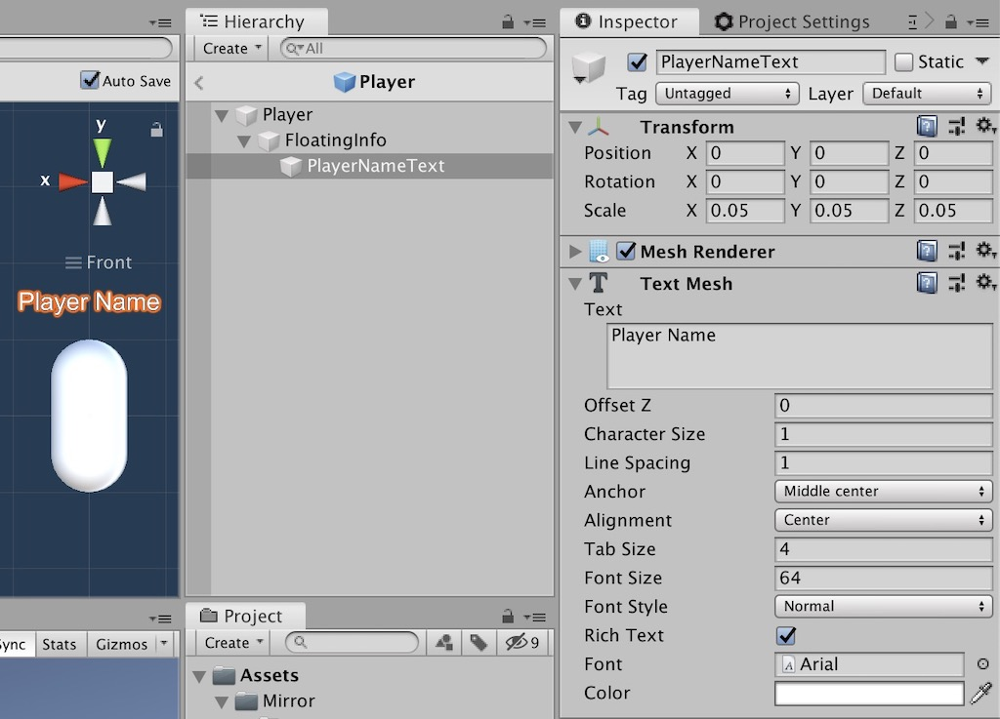

### Part 9 <a href="#part-9" id="part-9"></a>

Update your PlayerScript.cs with this:

```csharp
using Mirror;
using UnityEngine;

namespace QuickStart
{
    public class PlayerScript : NetworkBehaviour
    {
        public TextMesh playerNameText;
        public GameObject floatingInfo;

        private Material playerMaterialClone;

        [SyncVar(hook = nameof(OnNameChanged))]
        public string playerName;

        [SyncVar(hook = nameof(OnColorChanged))]
        public Color playerColor = Color.white;

        void OnNameChanged(string _Old, string _New)
        {
            playerNameText.text = playerName;
        }

        void OnColorChanged(Color _Old, Color _New)
        {
            playerNameText.color = _New;
            playerMaterialClone = new Material(GetComponent<Renderer>().material);
            playerMaterialClone.color = _New;
            GetComponent<Renderer>().material = playerMaterialClone;
        }

        public override void OnStartLocalPlayer()
        {
            Camera.main.transform.SetParent(transform);
            Camera.main.transform.localPosition = new Vector3(0, 0, 0);
            
            floatingInfo.transform.localPosition = new Vector3(0, -0.3f, 0.6f);
            floatingInfo.transform.localScale = new Vector3(0.1f, 0.1f, 0.1f);

            string name = "Player" + Random.Range(100, 999);
            Color color = new Color(Random.Range(0f, 1f), Random.Range(0f, 1f), Random.Range(0f, 1f));
            CmdSetupPlayer(name, color);
        }

        [Command]
        public void CmdSetupPlayer(string _name, Color _col)
        {
            // player info sent to server, then server updates sync vars which handles it on all clients
            playerName = _name;
            playerColor = _col;
        }

        void Update()
        {
            if (!isLocalPlayer)
            {
                // make non-local players run this
                floatingInfo.transform.LookAt(Camera.main.transform);
                return;
            }

            float moveX = Input.GetAxis("Horizontal") * Time.deltaTime * 110.0f;
            float moveZ = Input.GetAxis("Vertical") * Time.deltaTime * 4f;

            transform.Rotate(0, moveX, 0);
            transform.Translate(0, 0, moveZ);
        }
    }
}
```

### Part 10 <a href="#part-10" id="part-10"></a>

Add the `PlayerNameText` and `FloatingInfo` objects into the script on the player prefab, as shown below.


Now if you build and run, host on one, join on the other, you will see player names and colors synced across the network!

Well done, 5 stars to you!

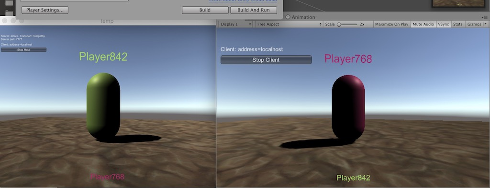

### Part 11 <a href="#part-11" id="part-11"></a>

A scene networked object all can access and adjust.

Create a SceneScript.cs, add it onto an empty GameObject in the scene called SceneScript.

Then create a Canvas with text and button, similar to below.

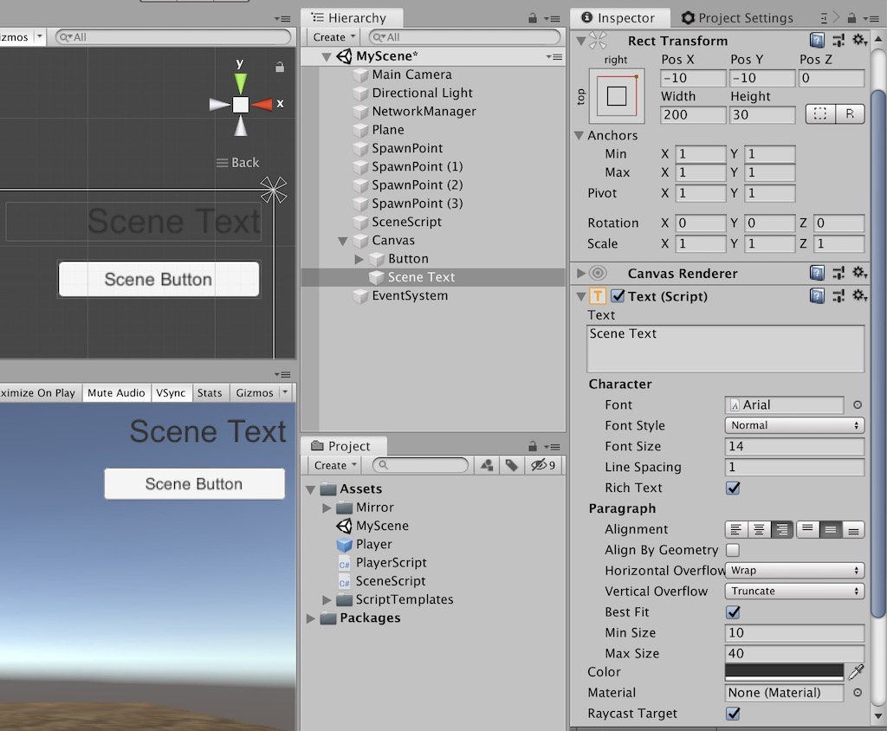

Add the sceneScript variable, Awake function, and CmdSendPlayerMessage to PlayerScript.cs Also add the new playerName joined line to CmdSetupPlayer();

```csharp
private SceneScript sceneScript;

void Awake()
{
    //allow all players to run this
    sceneScript = GameObject.FindObjectOfType<SceneScript>();
}

[Command]
public void CmdSendPlayerMessage()
{
    if (sceneScript) 
        sceneScript.statusText = $"{playerName} says hello {Random.Range(10, 99)}";
}

[Command]
public void CmdSetupPlayer(string _name, Color _col)
{
    //player info sent to server, then server updates sync vars which handles it on all clients
    playerName = _name;
    playerColor = _col;
    sceneScript.statusText = $"{playerName} joined.";
}

public override void OnStartLocalPlayer()
{
    sceneScript.playerScript = this;
    //. . . . ^ new line to add here
```

Add this code to SceneScript.cs

```csharp
using Mirror;
using UnityEngine;
using UnityEngine.UI;

namespace QuickStart
{
    public class SceneScript : NetworkBehaviour
    {
        public Text canvasStatusText;
        public PlayerScript playerScript;

        [SyncVar(hook = nameof(OnStatusTextChanged))]
        public string statusText;

        void OnStatusTextChanged(string _Old, string _New)
        {
            //called from sync var hook, to update info on screen for all players
            canvasStatusText.text = statusText;
        }

        public void ButtonSendMessage()
        {
            if (playerScript != null)  
                playerScript.CmdSendPlayerMessage();
        }
    }
}
```

* Attach the ButtonSendMessage function to your Canvas Button.
* Attach Canvas Scene Text to SceneScript variable.
  * ignore SceneScript’s, playerScript variable, it automatically sets this!
* Attach a NetworkIdentity component to the SceneScript gameobject, if it has not automatically done so.

 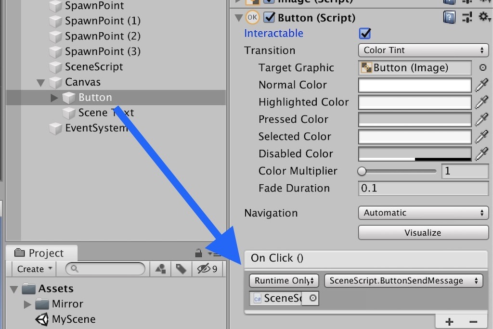 

Now if you build and run, host and join, you can send messages, and have a text log for actions!

Wahooo!

 

Experiment and adjust, have fun!

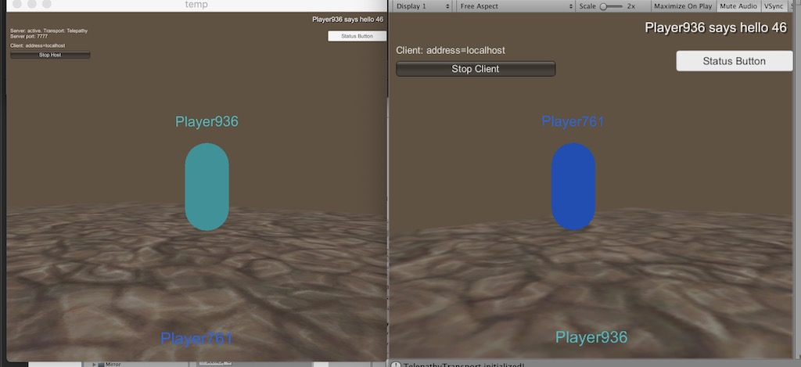

### Part 12 <a href="#part-12" id="part-12"></a>

Weapon switching! The code bits.

Add the following to your PlayerScript.cs

```csharp
private int selectedWeaponLocal = 1;
public GameObject[] weaponArray;

[SyncVar(hook = nameof(OnWeaponChanged))]
public int activeWeaponSynced = 1;

void OnWeaponChanged(int _Old, int _New)
{
    // disable old weapon
    // in range and not null
    if (0 < _Old && _Old < weaponArray.Length && weaponArray[_Old] != null)
        weaponArray[_Old].SetActive(false);
    
    // enable new weapon
    // in range and not null
    if (0 < _New && _New < weaponArray.Length && weaponArray[_New] != null)
        weaponArray[_New].SetActive(true);
}

[Command]
public void CmdChangeActiveWeapon(int newIndex)
{
    activeWeaponSynced = newIndex;
}

void Awake() 
{
    // disable all weapons
    foreach (var item in weaponArray)
        if (item != null)
            item.SetActive(false); 
}
```

Add the weapon switch button in update. Only local player switches its own weapon, so it goes below the `!isLocalPlayer` check.

```csharp
void Update()
{
    if (!isLocalPlayer)
    {
        // make non-local players run this
        floatingInfo.transform.LookAt(Camera.main.transform);
        return;
    }

    float moveX = Input.GetAxis("Horizontal") * Time.deltaTime * 110.0f;
    float moveZ = Input.GetAxis("Vertical") * Time.deltaTime * 4f;

    transform.Rotate(0, moveX, 0);
    transform.Translate(0, 0, moveZ);

    if (Input.GetButtonDown("Fire2")) //Fire2 is mouse 2nd click and left alt
    {
        selectedWeaponLocal += 1;

        if (selectedWeaponLocal > weaponArray.Length) 
            selectedWeaponLocal = 1; 

        CmdChangeActiveWeapon(selectedWeaponLocal);
    }
}
```

### Part 13 <a href="#part-13" id="part-13"></a>

Weapon models

Add the basic cube weapons first, change these later.

* Double click your player prefab to enter it
* Add a "WeaponsHolder" empty GameObject, with position and rotation at 0,0,0.
* Inside that GameObject, create a cube from unity menu, (GameObject, 3D object, cube)- Remove the box colliders.
* Rename this `Weapon1`, change position and scale to match the below pictures.

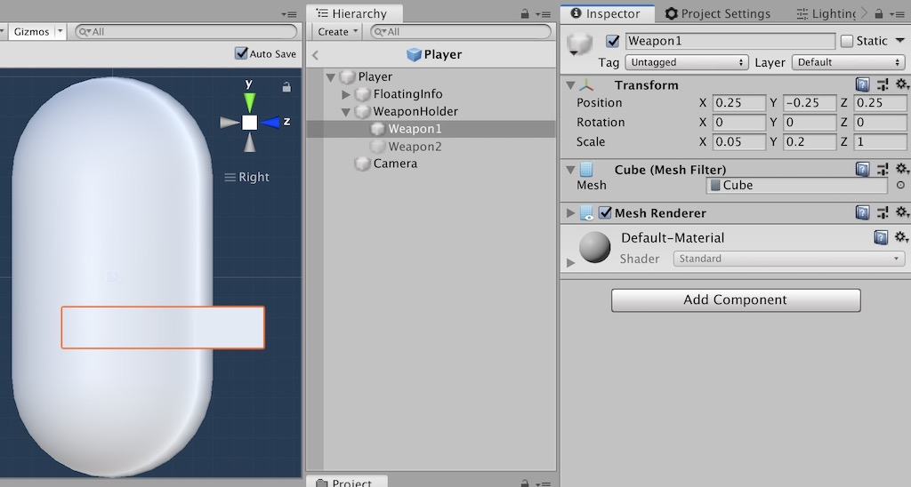

Duplicate weapon 1 for a Weapon 2, and change its scale and position, now you should have 2 different looking ‘weapons’!

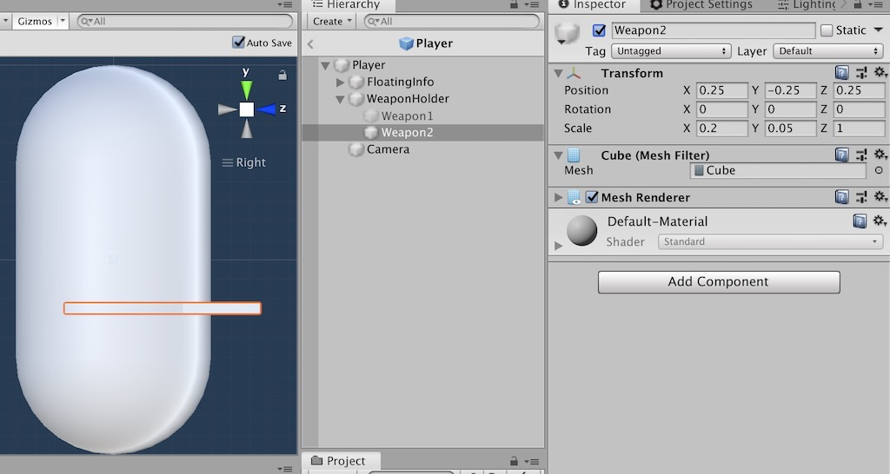

### Part 14 <a href="#part-14" id="part-14"></a>

Weapon switch finale.

* Add these 2 GameObjects to your PlayerScript.cs weapons array.
* Disable weapon 2, so only weapon 1 shows when spawning.

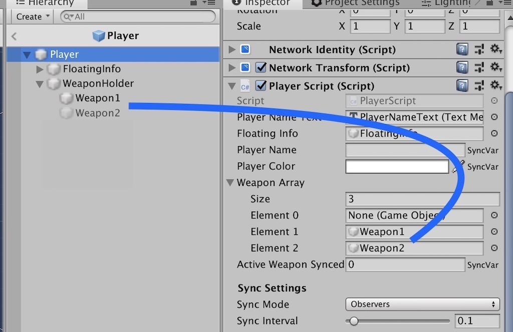

Build and run!

You should see each player switching weapons, and whatever your player has equipped, will auto show on new joining players (sync var and hook magic!)

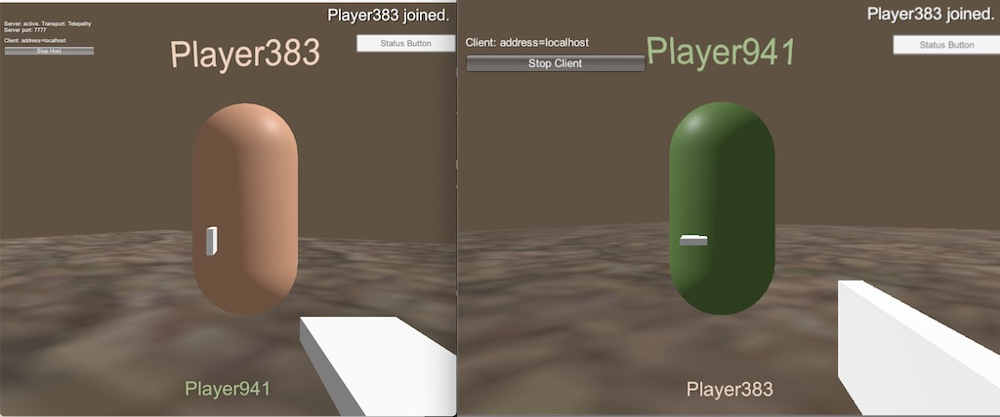

### Part 15 <a href="#part-15" id="part-15"></a>

Here we will make a small adjustment, as using a GameObject.Find() may not guarantee Network Identity scene objects are found. In the image below you can see our NetworkIdentity scene object gets disabled, as they are disabled until a player is in ‘ready’ status (ready status is usually set when player spawns).

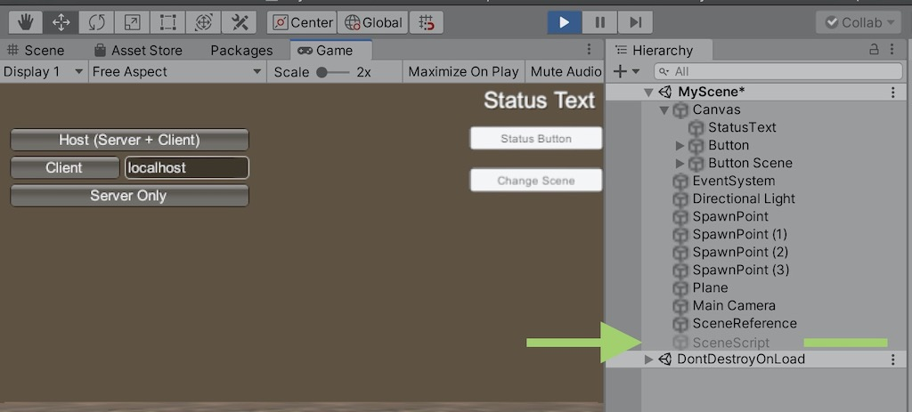

So our chosen workaround is to have our GameObject.Find() get the non-networked scene object, which will have those Network Identity scene object as pre-set variables.

Create a new script called SceneReference.cs, and add this one variable.

```csharp
using UnityEngine;

namespace QuickStart
{
    public class SceneReference : MonoBehaviour
    {
        public SceneScript sceneScript;
    }
}
```

Open up SceneScript.cs and add the following variable.

```csharp
public SceneReference sceneReference;
```

Now in your Unity scene create a gameobject, name it SceneReference, and add the new script. On both Scene gameobjects, set the reference to each other. So SceneReference can speak to SceneScript, and SceneScript to SceneReference.

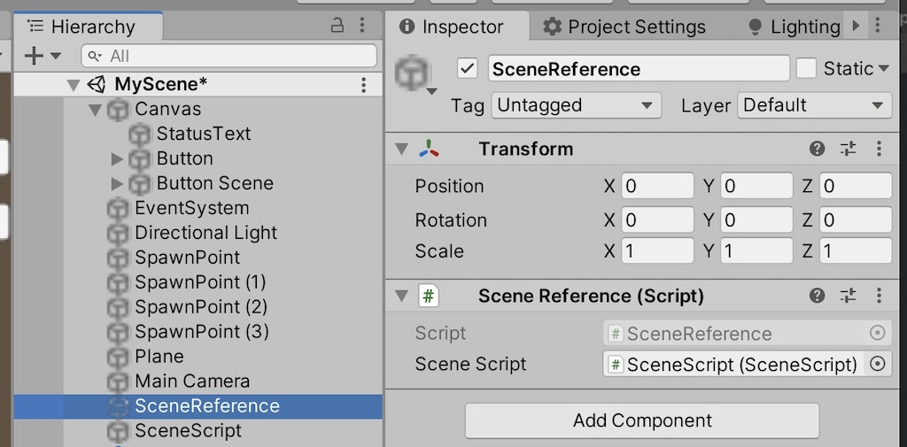

Open up PlayerScript.cs and overwrite the Awake function to this:

```csharp
void Awake()
{
	//allows all players to run this
	sceneScript = GameObject.Find(“SceneReference”).GetComponent<SceneReference>().sceneScript;
}
```

### Part 16 <a href="#part-16" id="part-16"></a>

Menu and Scene switching, here we will go from an offline Menu, with a play button, to a Games List with a back button and the Host/Join HUD, to your online map, and then a second map for host to switch to.

Open up SceneScript.cs and add the following function.

```csharp
public void ButtonChangeScene()
{
    if (isServer)
    {
        Scene scene = SceneManager.GetActiveScene();
        if (scene.name == "MyScene")
            NetworkManager.singleton.ServerChangeScene("MyOtherScene");
        else
            NetworkManager.singleton.ServerChangeScene("MyScene");
    }
    else
        Debug.Log("You are not Host.");
}
```

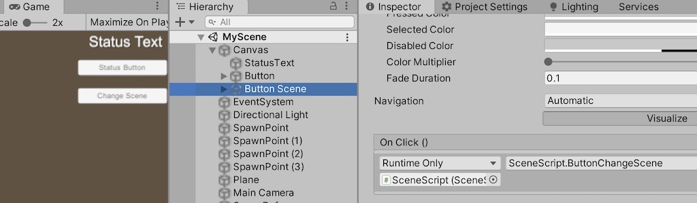

Duplicate your previous Canvas button, rename it and reposition it, then setup the OnClick() to point to SceneScript.ButtonChangeScene, like in the image.

Then drag your NetworkManager into your Project, to make it a Prefab, this way any changes we make later will apply to them all. If you haven’t already, you can sort out your project into folders, one for scripts, prefabs, scenes, textures etc. :)


### Part 17 <a href="#part-17" id="part-17"></a>

Save, and then Duplicate your MyScene, rename to make a Menu, GamesList and MyOtherScene, then add them to the build settings, with Menu being first.


Open up the Menu scene, remove the spawn points, SceneScript, SceneReference, Network Manager and Plane, so it looks like the below. Adjust the canvas button to say Play, centre it. Here is where you could add the Scores scene, Contact section, News, etc

Create a Menu.cs script, add it onto a Menu gameObject.

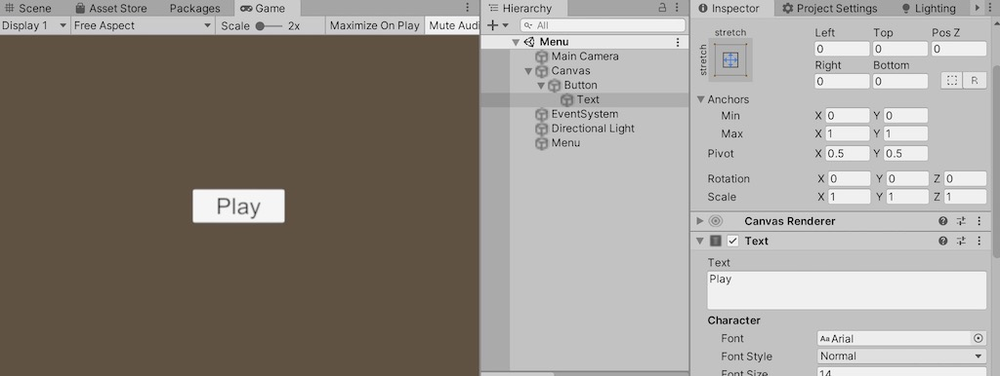

Add the code to Menu.cs, then in the Button, drag the Menu gameobject into the On Click () and set it to Menu.LoadScene, like in the picture.

```csharp
using UnityEngine;
using UnityEngine.SceneManagement;

namespace QuickStart
{
    public class Menu : MonoBehaviour
    {
        public void LoadScene()
        {
            SceneManager.LoadScene("GamesList");
        }
    }
}
```


### Part 18 <a href="#part-18" id="part-18"></a>

Open up GamesList scene, do similar to Menu but KEEP NetworkManager prefab.

Create a GamesList.cs, add the code, and add it onto a GamesList gameobject in the scene. Adjust a canvas button to say Menu (this is our back button). It should look like the image below.

* The games list is where you can add List server contents, or matchmaker, or just the host and join buttons, similar to the default NetworkManagerHud, for now leave this. :)

```csharp
using UnityEngine;
using UnityEngine.SceneManagement;

namespace QuickStart
{
    public class GamesList : MonoBehaviour
    {
        public void LoadScene()
        {
            SceneManager.LoadScene("Menu");
        }
    }
}
```

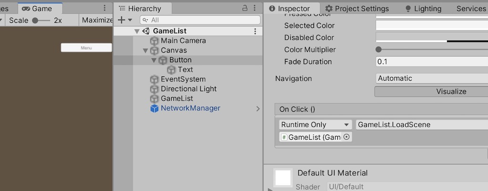

### Part 19 <a href="#part-19" id="part-19"></a>

Open MyOtherScene, this is our second map. Change the camera background colour and floor material (or anything, just so you can see both scenes are different. To summarise, MyScene is map 1 and MyOtherScene is map 2.

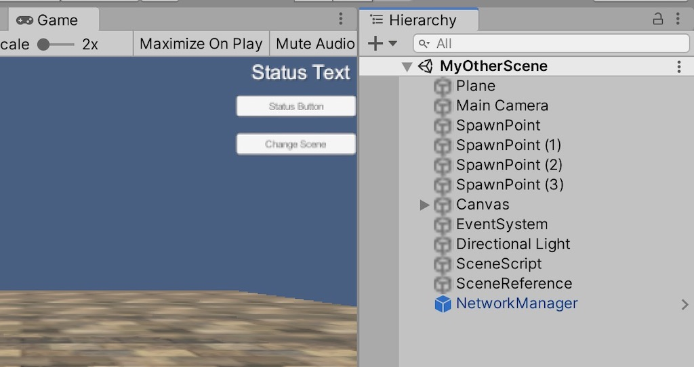

In your NetworkManager prefab in PROJECT (not the one in scenes), add Menu to offline, and MyScene to Online variables. This should change all the NetworkManager prefabs to have these settings.


Build and Run, press Play on the Menu to go to GamesList, then click Host (for player 1). For player 2, press Play on Menu, then client connect on GamesList.

Now the host can change scenes between map 1 and map 2, and if anyone disconnects or stops the game, Menu scene is load to start again. This whole process can be tidied up, but should provide a good scene switch template to your Mirror game :)

### Part 20 <a href="#part-20" id="part-20"></a>

Here we will add basic weapon firing, using rigidbody prefabs. Raycasts with a representation of the fired object is usually better to do this, and keep phycisal objects for things like Grenades and Cannon balls. This section will also lack a lot of security and anti-cheat techniques in order to keep the guide simple, but anyway, here we go!

Double click the Player Prefab to open it, create empty gameobjects and line them up with the end of your weapon, add them as child to each weapon. Some weapons may be short pistols, others long rifles, so the place where objects spawn will be different.

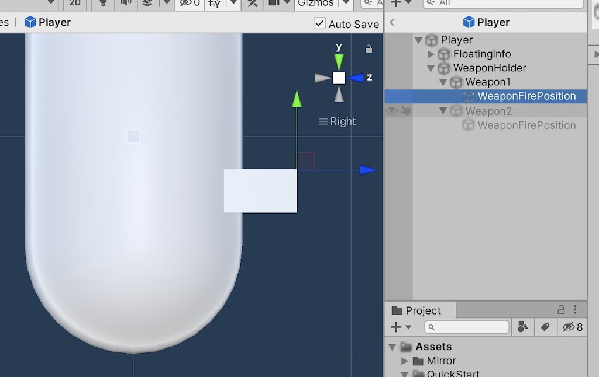

Create a Weapon.cs script, add it to the Weapon1 and Weapon 2 gameObjects inside the player prefab.

```csharp
using UnityEngine;

namespace QuickStart
{
    public class Weapon : MonoBehaviour
    {
        public float weaponSpeed = 15.0f;
        public float weaponLife = 3.0f;
        public float weaponCooldown = 1.0f;
        public int weaponAmmo = 15;

        public GameObject weaponBullet;
        public Transform weaponFirePosition;
    }
}
```

### Part 21 <a href="#part-21" id="part-21"></a>

Now back in your scene we shall make 2 bullets, in Unitys menu, go to GameObject, 3D Object, Sphere. Add rigidbody to this sphere, make the scale 0.2, 0.2, 0.2, then save it as a Prefab in the Project.
Do the same with a cube, so you have two different looking bullets.

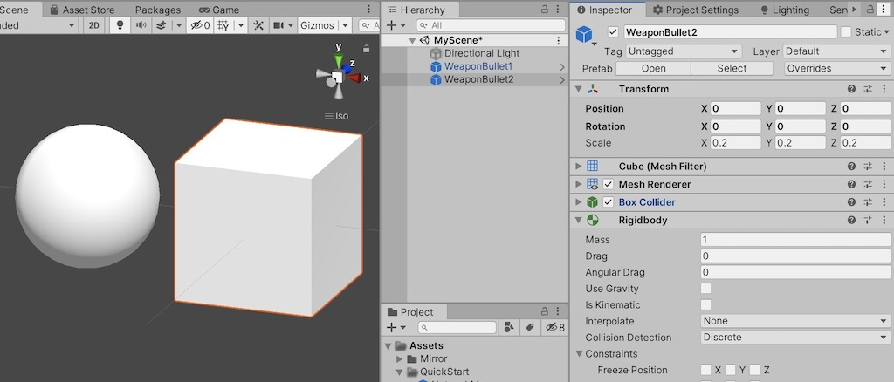

Inside your player prefab again, select a weapon, and set the variables on weapon script.

 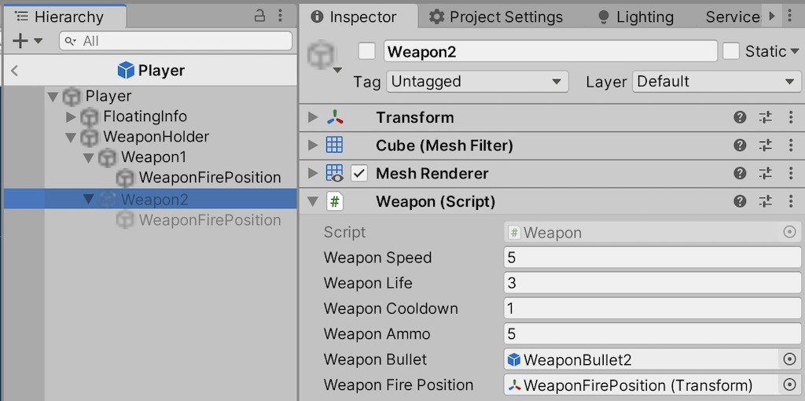

### Part 22 <a href="#part-22" id="part-22"></a>

In SceneScript.cs, add this variable and function.

```csharp
public Text canvasAmmoText;
    
public void UIAmmo(int _value)
{
    canvasAmmoText.text = "Ammo: " + _value;
}
```

Enter MyScene (map 1). Duplicate the Canvas StatusText, rename to Ammo, then drag that Ammo text UI into SceneScript gameobject, canvasAmmoText variable. Do this on BOTH MyScene (map 1) and MyOtherScene (map 2), as we have not yet linked or prefabbed our canvas and scene scripts to auto update changes on each map.

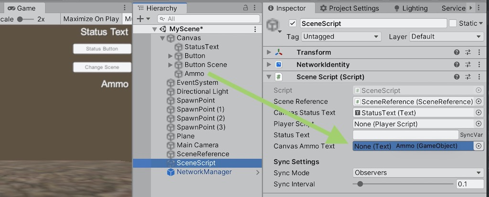

Open up PlayerScript.cs, add these two variables:

```csharp
private Weapon activeWeapon;
private float weaponCooldownTime;  
```

In the ‘OnWeaponChanged’ function, update it with the new line, so it should look like this.


```csharp
void OnWeaponChanged(int _Old, int _New)
{
    // disable old weapon
    // in range and not null
    if (0 < _Old && _Old < weaponArray.Length && weaponArray[_Old] != null)
        weaponArray[_Old].SetActive(false);
    
    // enable new weapon
    // in range and not null
    if (0 < _New && _New < weaponArray.Length && weaponArray[_New] != null)
    {
        weaponArray[_New].SetActive(true);
        activeWeapon = weaponArray[activeWeaponSynced].GetComponent<Weapon>();
        if (isLocalPlayer)
            sceneScript.UIAmmo(activeWeapon.weaponAmmo);
    }
}
```

In Awake(), add this at the end:

```csharp
if (selectedWeaponLocal < weaponArray.Length && weaponArray[selectedWeaponLocal] != null)
{
    activeWeapon = weaponArray[selectedWeaponLocal].GetComponent<Weapon>();
    sceneScript.UIAmmo(activeWeapon.weaponAmmo);
}
```

In Update(), add this at the end:

```csharp
if (Input.GetButtonDown("Fire1") ) //Fire1 is mouse 1st click
{
    if (activeWeapon && Time.time > weaponCooldownTime && activeWeapon.weaponAmmo > 0)
    {
        weaponCooldownTime = Time.time + activeWeapon.weaponCooldown;
        activeWeapon.weaponAmmo -= 1;
        sceneScript.UIAmmo(activeWeapon.weaponAmmo);
        CmdShootRay();
    }
}
```

Add these two functions after the Update() {} function finishes.

```csharp
[Command]
void CmdShootRay()
{
    RpcFireWeapon();
}

[ClientRpc]
void RpcFireWeapon()
{
    //bulletAudio.Play(); muzzleflash  etc
    GameObject bullet = Instantiate(activeWeapon.weaponBullet, activeWeapon.weaponFirePosition.position, activeWeapon.weaponFirePosition.rotation);
    bullet.GetComponent<Rigidbody>().velocity = bullet.transform.forward * activeWeapon.weaponSpeed;
    Destroy(bullet, activeWeapon.weaponLife);
}
```

Build and Run, you should have firing, with different speeds and cooldowns on all players :)


