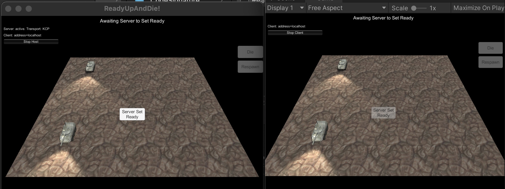
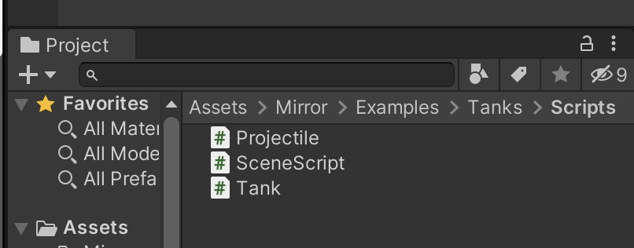
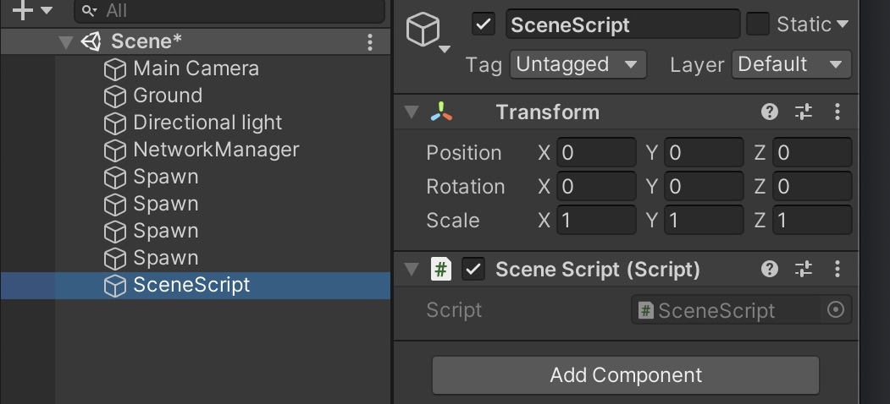
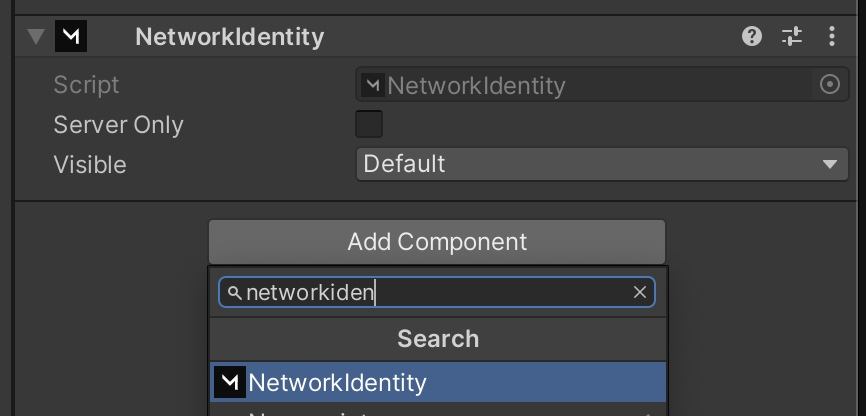
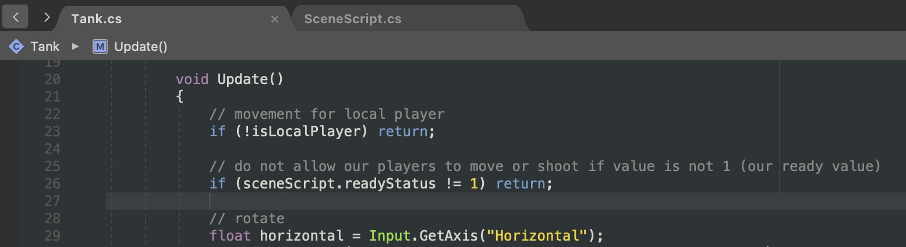
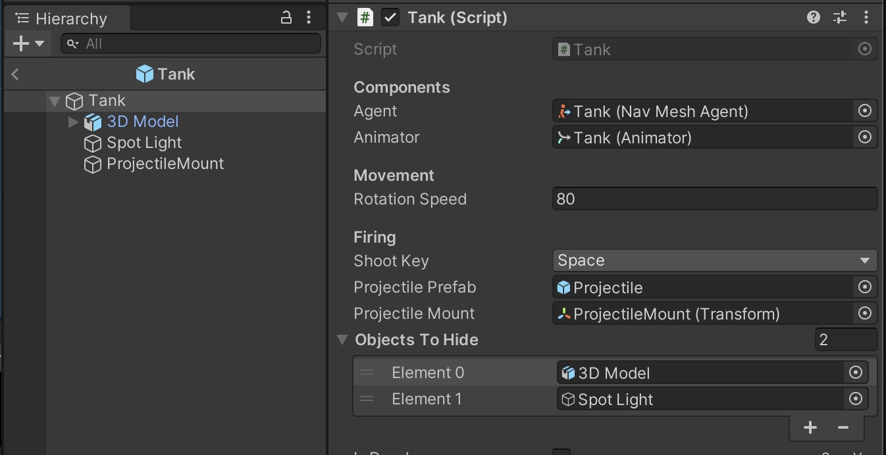
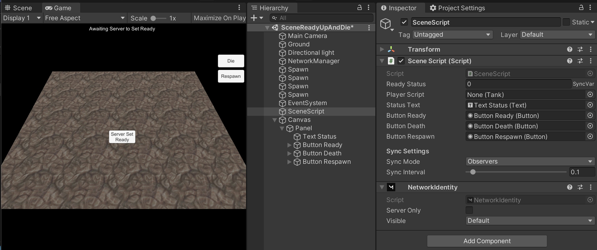

# Ready Up And Die!

## End Result:

1: To create a “ready up” feature, this will prevent players from moving until server/host says go.

2: An “isDead” player status to create a death and respawn.



## **Part 1:**

Blank Project, import Mirror from Asset Store/ Discord Releases unity package.&#x20;

Open up your scene, for this guide we will use Mirror/Examples/Tanks

You should be familiar with the examples, if not, have a quick play, build and run, join yourself by having two games on same PC connecting via 'localhost'.


## **Part 2:**

Create a script called SceneScript, due to this guide modifying Mirrors Example scenes, make sure it is in same folder as Tank script.

Add this script onto a game object in the scene, also named SceneScript, this will be our canvas to player link as well as our 'scene manager', then attach a NetworkIdentity component, like below.







## **Part 3:**

Open up this SceneScript.cs, and add the following code, parts will be commented to explain  :)


```csharp
using UnityEngine;
using UnityEngine.UI;
using Mirror;

// For your game, no need to use this namespace, its just for tank example modification  :)
namespace Mirror.Examples.Tanks
{

    public class SceneScript : NetworkBehaviour
    {
        [SyncVar(hook = nameof(OnReadyChanged))]
        public int readyStatus = 0;

        void OnReadyChanged(int _Old, int _New)
        {
            //this hook is fired when readyStatus is changed via client cmd or directly by host
            // you dont need to use _New, as the variable readyStatus is changed before hook is called

            if (readyStatus == 1)
            {
                statusText.text = "Server Says Go!";
                buttonReady.gameObject.SetActive(false);
            }
            // updating our canvas UI
            SetupScene();
        }

        public Tank playerScript; // this is set by local player, so UI has reference to your player only
        public Text statusText;
        public Button buttonReady, buttonDeath, buttonRespawn;
        

        private void Start()
        {
            //Make sure to attach these Buttons in the Inspector
            buttonReady.onClick.AddListener(ButtonReady);
            //you could choose to fully hide the server only buttons from clients, but for this guide we will show them to have less code involved
            buttonDeath.onClick.AddListener(ButtonDeath);
            buttonRespawn.onClick.AddListener(ButtonRespawn);
        }

        //[ServerCallback]
        public void ButtonReady()
        {
            // you can use the [ServerCallback] tag if server is only ever going to use the function, or do a check inside for  if( isServer ) { }
            if (isServer)
            {
                // optional checks to wait for full team, you can add this in connection joining callbacks, or via UI, upto you.
                //if (NetworkServer.connections.Count > 2)
                //{
                    readyStatus = 1;
                //}
                //else
                //{
                //    playerStatusText.text = "Not enough players.";
                //}
            }
            else
            {
                statusText.text = "Server only feature";
            }
        }

        // For faster prototyping, we will have these as buttons, but eventually they will be in your raycast, or trigger code
        public void ButtonDeath()
        {
            playerScript.CmdPlayerStatus(true);
        }

        public void ButtonRespawn()
        {
            playerScript.CmdPlayerStatus(false);
        }

        public void SetupScene()
        {
            if (isServer == false)
            {
                buttonReady.interactable = false;
            }

            if (readyStatus == 0)
            {
                buttonRespawn.interactable = false;
                buttonDeath.interactable = false;
            }
            else if (playerScript)
            {
                // quick check to make sure playerScript is set before checking its variables to prevent errors
                if (playerScript.isDead == true)
                {
                    buttonRespawn.interactable = true;
                    buttonDeath.interactable = false;
                }
                else if (playerScript.isDead == false)
                {
                    buttonRespawn.interactable = false;
                    buttonDeath.interactable = true;
                }
            }
        }
     }
}
```


## **Part 4:**

Now open Tank.cs, this is the guides equivalent to your eventual PlayerScript.

And in the Update function, below the isLocalPlayerCheck, add:\
&#x20;if (sceneScript.readyStatus != 1) return;

This will stop the tanks below code (movement and projectile firing) from running until ready.



Add the code at the bottom of Tank.cs, after the “RpcOnFire” ends.

(But still inside the namespace { }  )


```csharp
public GameObject[] objectsToHide;
private SceneScript sceneScript;

[SyncVar(hook = nameof(OnChanged))]
public bool isDead = false;

void OnChanged(bool _Old, bool _New)
{
    if (isDead == false) // respawn
    {
        // allow user to kill themselves via button, just for prototyping
        foreach (var obj in objectsToHide)
        {
            obj.SetActive(true);
        }

        if (isLocalPlayer)
        {
            // Uses NetworkStartPosition feature, optional.
            this.transform.position = NetworkManager.startPositions[Random.Range(0, NetworkManager.startPositions.Count)].position;
        }

        sceneScript.statusText.text = "Player Respawned";
    }
    else if (isDead == true) // death
    {
        // have meshes hidden, disable movement and show respawn button
        foreach (var obj in objectsToHide)
        {
            obj.SetActive(false);
        }

        sceneScript.statusText.text = "Player Defeated";
    }

    if (isLocalPlayer)
    {
        sceneScript.SetupScene();
    }
}

void Awake()
{
    //allow all players to run this, maybe they will need references to it in the future
    sceneScript = GameObject.FindObjectOfType<SceneScript>();
}

public override void OnStartLocalPlayer()
{
    // local player sets reference to scene scripts variable, so they can communicate with each other
    // you could also use regular Start() and if( isLocalPlayer ) { } instead of  OnStartLocalPlayer()
    sceneScript.playerScript = this;
    sceneScript.SetupScene();
}

[Command]
public void CmdPlayerStatus(bool _value)
{
    // player info sent to server, then server changes sync var which updates, causing hooks to fire
    isDead = _value;
}
```


## **Part 5:**

For this method during death and respawn, rather than destroying the player, we will hide and reshow it.

Open up the Tank player prefab, and add the two child objects to the “Objects To Hide” array, “ProjectileMount” is just an empty position marker, and does not need to be added.

Upon the sync var change of “isDead”, the hook callback will cycle through this array.



## **Part 6:**

Create a Canvas in the scene, by either right clicking, UI canvas, or the menu at top, GameObject, UI, Canvas.\
Set the canvas scaler to “Scale with Screen Size”, this will help with keeping everything same size, on both low and high resolution screens, and is best to set before adding Canvas contents.


Create your Unity Canvas UI, with a text, and 3 buttons, label them for easier reference.

Here I have placed Status text at top, Server Set Ready button in the middle, and the Die and Respawn buttons to the right.\
After this set the variables to the correct UI on your SceneScript, like below.



## **Part 7:**

Build and Run!

Enjoy  :)

(To help with side by side play testing - Project settings, Player, Resolution and Presentation, Fullscreen Mode to “Windowed”.)


