# Unity Canvas HUD


Note: A pre-made UI Canvas prefab is now available in Mirror/Examples/Common/CanvasNetworkManagerHUD.


## End Result:

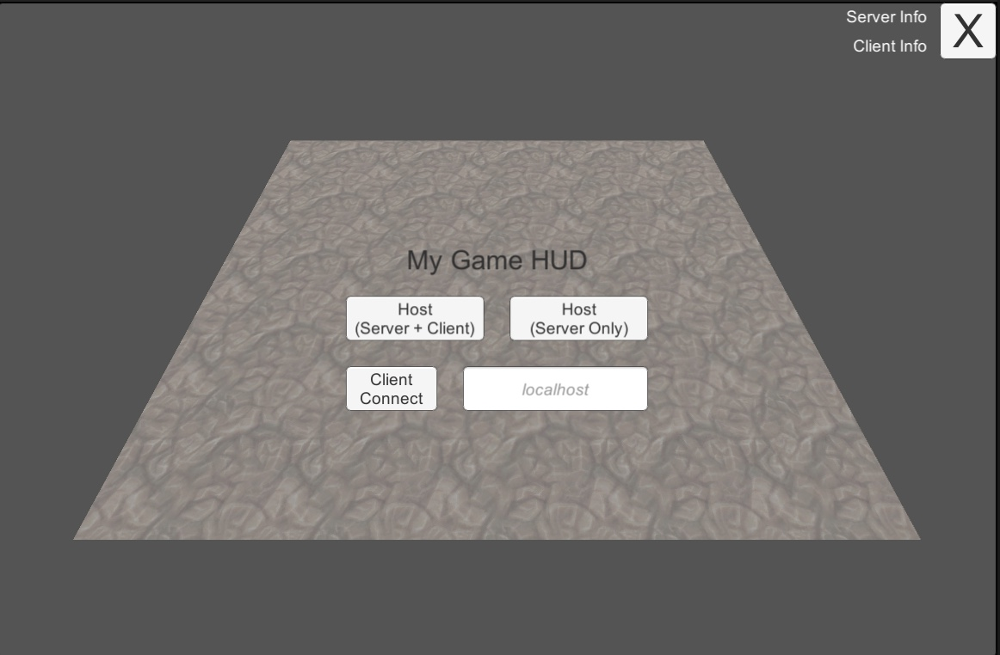

## Part 1

Blank Project, import Mirror from Asset Store/ Discord Releases unity package.&#x20;

Open up your scene, for this guide we will use Mirror/Examples/Tanks

You should be familiar with the examples, and default NetworkManager HUD, they look something like this:

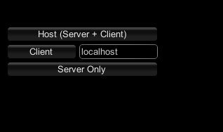

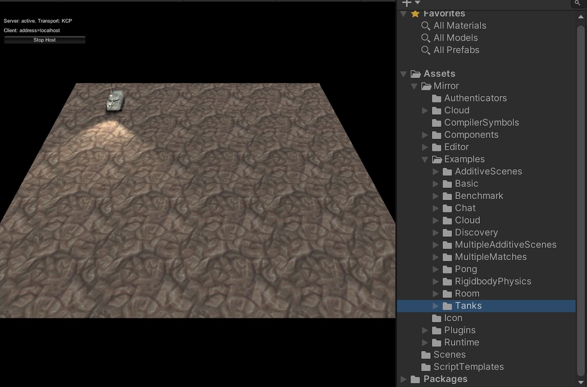

## Part 2

Create a Canvas in the scene, by either right clicking, UI canvas, or the menu at top, GameObject, UI, Canvas.\
&#x20;Set the canvas scaler to “Scale with Screen Size”, this will help with keeping everything same size, on both low and high resolution screens, and is best to set before adding Canvas contents.

Then create and attach a new script to the canvas, I have named it CanvasHUD.

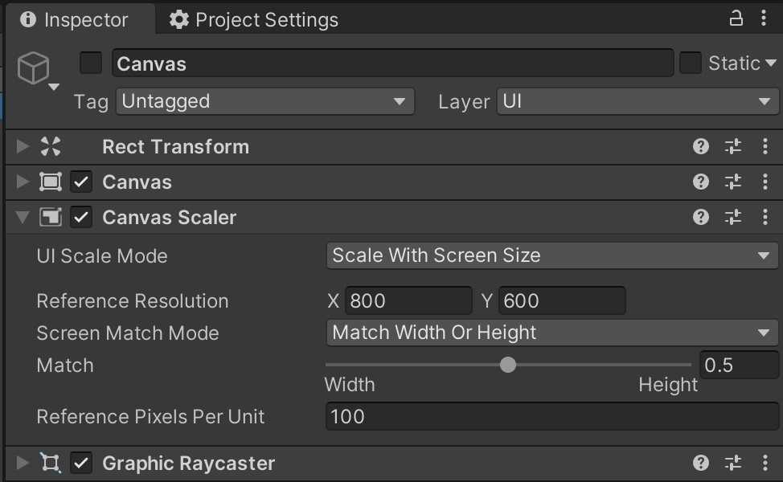

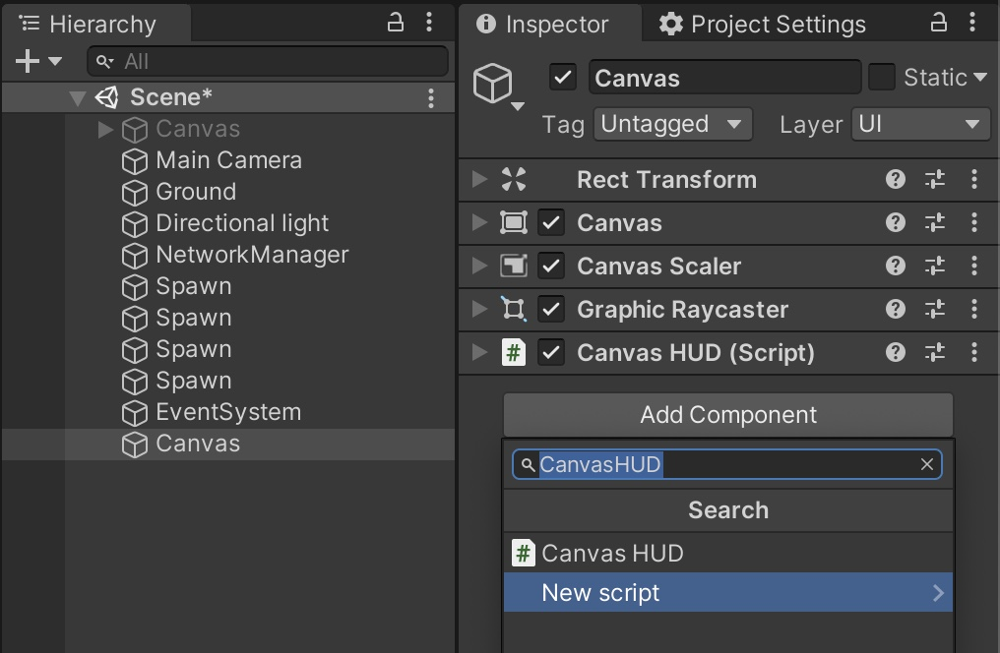

## Part 3

Open up this new script, and open up Mirrors NetworkManagerHUD (for reference).

Add the following code as the starting template to CanvasHUD.


```csharp
using Mirror;
using UnityEngine;
using UnityEngine.UI;

public class CanvasHUD : MonoBehaviour
{
	public Button buttonHost;

	public void Start()
	{
		buttonHost.onClick.AddListener(ButtonHost);
  }

	public void ButtonHost()
	{
		NetworkManager.singleton.StartHost();
	}
}
```


Create a button inside the main Canvas, and drag it into the Canvas “ButtonHost” variable. We will not focus too much on layout and looks of the canvas for this guide, but go wild and position the contents where you please :)

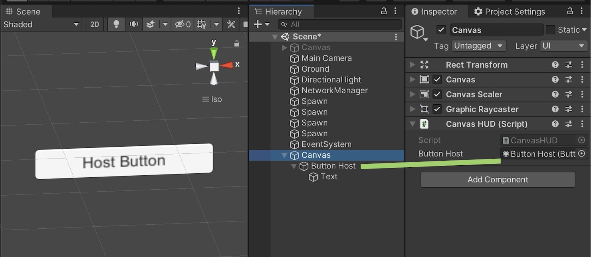

## Part 4

Test!  Start the game, and press your own “Host Button”, the game should start.

Congratulations, this is the first step to using Unity Canvas with Mirror, and upgrading from the NetworkManagerHUD OnGUI.

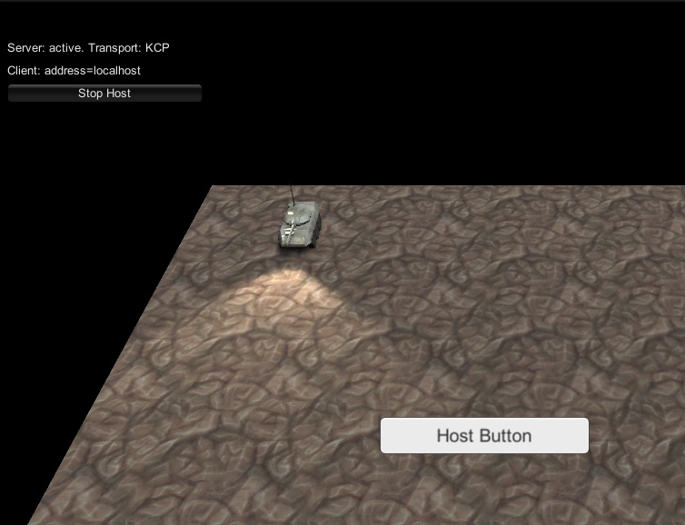

## Part 5

If you check the old HUD, it can be summarised into 2 parts. The ‘Start’ (before connecting) and ‘Stop’ (after connecting).

Create 2 UI panels inside the canvas, rename them Panel Start and Panel Stop, remove the image component from Panel Stop, this way we can tell them apart.

Drag your “Button Host” into Panel Start.

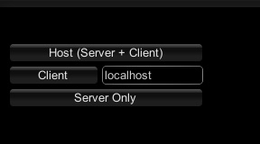

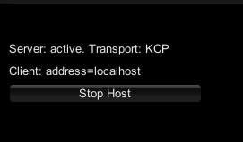

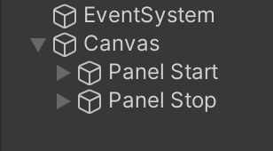

## Part 6

Add the following variables to your CanvasHUD script, these variables cover most of what is needed.


```csharp
public GameObject PanelStart;
public GameObject PanelStop;

public Button buttonHost, buttonServer, buttonClient, buttonStop;

public InputField inputFieldAddress;

public Text serverText;
public Text clientText;
```


Next, add more UI !  Exciting right!  :D

Don’t worry about the code yet, check the image below to see what is needed.

Inside “Panel Start” there should be 3 buttons, inputField and optional title text.\
&#x20;Panel Stop should contain one button, and 2 texts, you can remove, add, and adjust things after, but for now follow this guide so everything matches up.

Drag all the new UI into the CanvasHUD script variables, if you have labelled them all nicely when going along, it will be an easier task.

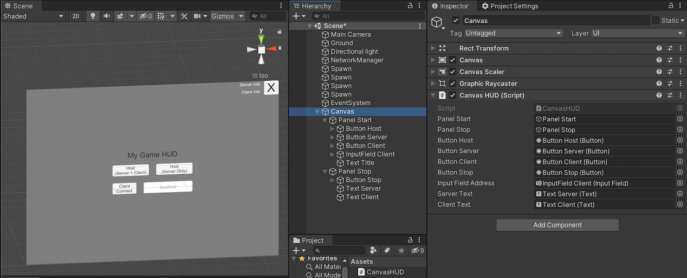

## Part 7

Now for the code to make it all work, various parts will have comments to explain.\
And this is it, you have now made your own Unity Canvas HUD UI, or upgraded the OnGUI NetworkManagerHUD!  :D


```csharp

    private void Start()
    {
        //Update the canvas text if you have manually changed network managers address from the game object before starting the game scene
        if (NetworkManager.singleton.networkAddress != "localhost") { inputFieldAddress.text = NetworkManager.singleton.networkAddress; }

        //Adds a listener to the main input field and invokes a method when the value changes.
        inputFieldAddress.onValueChanged.AddListener(delegate { ValueChangeCheck(); });

        //Make sure to attach these Buttons in the Inspector
        buttonHost.onClick.AddListener(ButtonHost);
        buttonServer.onClick.AddListener(ButtonServer);
        buttonClient.onClick.AddListener(ButtonClient);
        buttonStop.onClick.AddListener(ButtonStop);

        //This updates the Unity canvas, we have to manually call it every change, unlike legacy OnGUI.
        SetupCanvas();
    }

    // Invoked when the value of the text field changes.
    public void ValueChangeCheck()
    {
        NetworkManager.singleton.networkAddress = inputFieldAddress.text;
    }

    public void ButtonHost()
    {
        NetworkManager.singleton.StartHost();
        SetupCanvas();
    }

    public void ButtonServer()
    {
        NetworkManager.singleton.StartServer();
        SetupCanvas();
    }

    public void ButtonClient()
    {
        NetworkManager.singleton.StartClient();
        SetupCanvas();
    }

    public void ButtonStop()
    {
        // stop host if host mode
        if (NetworkServer.active && NetworkClient.isConnected)
        {
            NetworkManager.singleton.StopHost();
        }
        // stop client if client-only
        else if (NetworkClient.isConnected)
        {
            NetworkManager.singleton.StopClient();
        }
        // stop server if server-only
        else if (NetworkServer.active)
        {
            NetworkManager.singleton.StopServer();
        }

        SetupCanvas();
    }

    public void SetupCanvas()
    {
        // Here we will dump majority of the canvas UI that may be changed.

        if (!NetworkClient.isConnected && !NetworkServer.active)
        {
            if (NetworkClient.active)
            {
                PanelStart.SetActive(false);
                PanelStop.SetActive(true);
                clientText.text = "Connecting to " + NetworkManager.singleton.networkAddress + "..";
            }
            else
            {
                PanelStart.SetActive(true);
                PanelStop.SetActive(false);
            }
        }
        else
        {
            PanelStart.SetActive(false);
            PanelStop.SetActive(true);

            // server / client status message
            if (NetworkServer.active)
            {
                serverText.text = "Server: active. Transport: " + Transport.active;
                // Note, older mirror versions use: Transport.activeTransport
            }
            if (NetworkClient.isConnected)
            {
                clientText.text = "Client: address=" + NetworkManager.singleton.networkAddress;
            }
        }
    }
```



