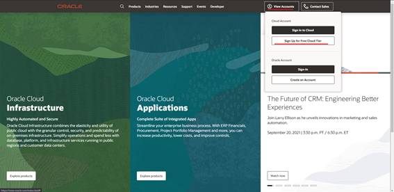
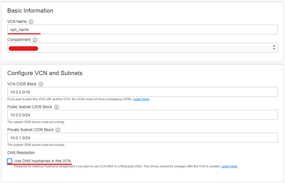
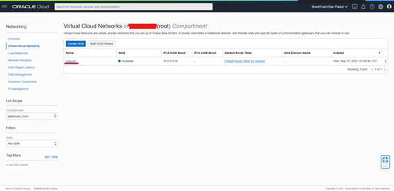
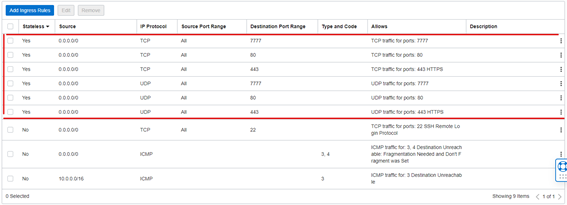
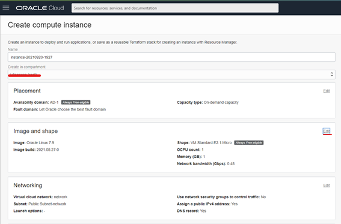
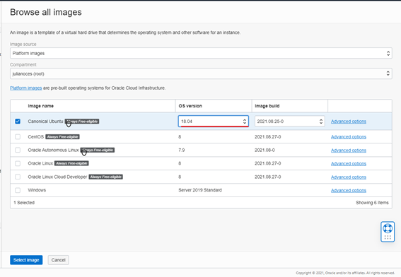
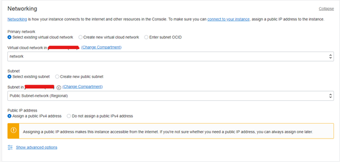
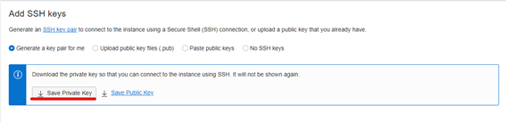
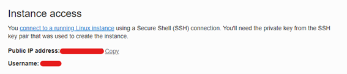
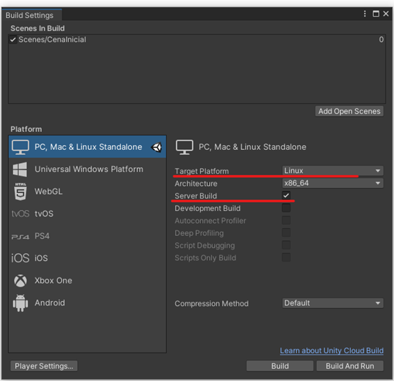

# Oracle Free Tier

## Create and configure your cloud machine

Access the [Oracle](https://oracle.com) website. Click on **View accounts**, then click on **Sign up for free Cloud Tier**.



Click on **Start for free**, fill out the form, and create your account. Sign in with your Oracle account. If your account is under validation, wait a few minutes before proceeding with the steps. Click on **Set up a network with a wizard**. Select **Create VCN with internet Connectivity**, and click on **Start VCN Wizard**.

.png>)

Fill in **VCN name** and disable the option **Use DNS hostname in this VCN**, click on **Next**, and wait.



Click on **VCN name** to create rules. Select **Public-Subnet-network**, and then click on **Default Security List for network**.



Click on **Add Ingress Rules**, and create the following rules for:

- Protocol TCP
  - Port range: 80, 443, and 7777
  - Select Stateless option
- Protocol UDP
  - Port range: 80, 443, and 7777
  - Select Stateless option



Go to **Homepage** and click on **Create a VM Instance**. Fill out **Computer instance name**, and click on **Edit** in the **Image and shape** group.



Click on **Change image**, select **Canonical Ubuntu**, OS Version **18.04**, and click on **Select Image**.



In the **Network group**, check if the network is the one created in the previous steps.



In **Add SSH Keys**, click on **Save Private Key**. Save this in a safe place; it will be necessary to access your machine.



In Boot Volume, you can specify HD Size, or you can use your 100 GB in one machine. Click on Create and wait. Go back to Home, click on **Dashboard** > **Compute** > **Instance**, select your instance, and copy **IP Address**.



## Access your machine

Open the PowerShell editor and type the following command:

```
ssh -i [ssh_key_place] ubuntu@[machine_ip]
```

Example:

```
ssh -i c:\users\user\desktop\ssh-key-2021-09-15.key ubuntu@0.0.0.0
```

> If you get an error while trying to connect to your cloud machine, you can fix it by right-clicking on ssh-key, select properties > security > advanced > remove inheritance, and delete all other users, keeping only your Windows user.

After you connect, run the following commands to add firewall rules into Ubuntu:

```
sudo apt install firewalld
sudo firewall-cmd --zone=public --add-port=7777/tcp --permanent
sudo firewall-cmd --zone=public --add-port=7777/udp --permanent
sudo firewall-cmd --reload
```

Download FileZilla, and follow the steps below to connect to your cloud machine using your ssh-key:

[https://filezillapro.com/docs/v3/basic-usage-instructions/ssh-private-keys-for-sftp/](https://filezillapro.com/docs/v3/basic-usage-instructions/ssh-private-keys-for-sftp/)

## Create Build

In Unity, access **File** > **Build Settings** > **Select Linux** > **Mark Server Build**. Wait for the build to finish, and then upload your files with FileZilla.



This tutorial uses a server folder, but this is optional.

Use the following commands:

```
ssh -i c:\users\user\desktop\ssh-key-2021-09-15.key ubuntu@0.0.0.0
cd server
chmod +x ./[your_project_name].x86_64
./[your_project_name].x86_64
```

Your server should now be running!
