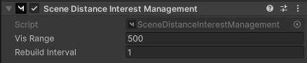

# Scene + Distance

Combines [Scene](scene.md) and [Distance](distance.md) Interest Management.

<figure><figcaption>
Scene Distance Interest Management
</figcaption></figure>

You will need to add Distance Custom Range components to any large, networked objects in the scene, especially an Environment object, terrains, or ground planes that have a pivot in the center of the scene which would be unusually far from the player when they're near the scene edges.
