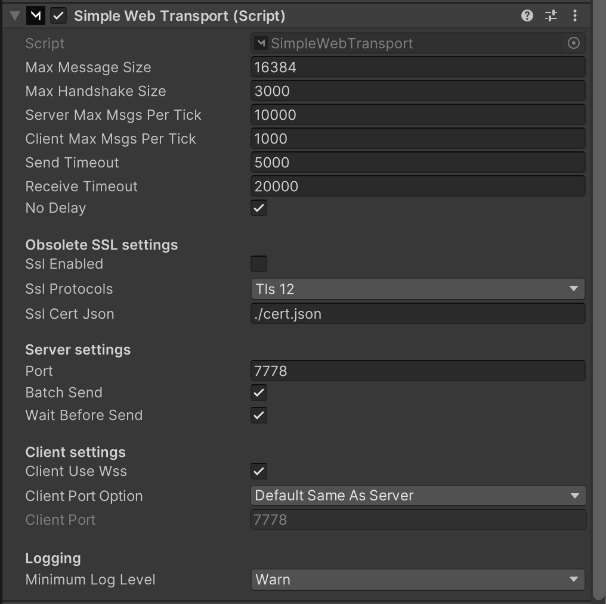

# WebSockets Transport

A Mirror transport that uses the [websocket protocol](https://en.wikipedia.org/wiki/WebSocket), thus enabling multiplayer in the browser from Unity WebGL builds!

## SSL Settings 

SSL settings is obsolete and may be removed in a future release.


NOTE: WebGL performs a lot better with a Reverse Proxy, and that's generally easier to set up and maintain than using cert.json and PFX files.

\
Go to the [Reverse Proxy](reverse-proxy/) page for instructions.


For legacy purposes, you can read more about simple web transport and SSL in this [SSL guide](ssl.md).

## Server Settings 

Specify what port the websocket based game server listens on.

## Client Settings 

These settings allow for users to customize web game client behavior.

For example, you may want to introduce a reverse proxy server, and you want to configure the web game clients to connect to the reverse proxy server instead of the game server directly. These settings enable you to do that.

## Logging 

Supported log levels:

* `None`
* `Error`
* `Warn` (default)
* `Info`
* `Verbose`
* `Flood`

Log levels can be set using the dropdown on the transport or setting `Mirror.SimpleWeb.Log.level` in code directly.

For debugging purposes, it is encouraged to set the log level to `Verbose` (or `Flood` in extreme cases). For normal use `Info` or `Warn` is recommended.

Setting the log level to `None` will disable logging completely. Use this option with extreme caution.


The transport applies the dropdown value in its `Awake` and `OnValidate` methods.


#### Log methods 

Log methods in this transport use [ConditionalAttribute](https://docs.microsoft.com/en-us/dotnet/api/system.diagnostics.conditionalattribute?view=netstandard-2.0), so they are removed depending on the preprocessor defines.

This preprocessor symbol effects the logging:

* `DEBUG` allows warn/error logs.

See the [Unity docs](https://docs.unity3d.com/Manual/PlatformDependentCompilation.html) on how to set custom preprocessor defines.
